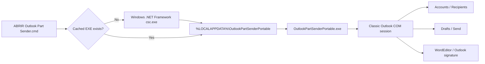

# Outlook Part Sender

> **Too many attachments for one email? Split the delivery into numbered Outlook emails in a few clicks.**


[](../../releases/latest)
[](#why-the-portable-version)
[](#requirements)
[](#requirements)
[](src/OutlookPartSenderPortable.cs)
[](LICENSE)

**Current recommended release: `v3.1.0 Portable Corporate`.**

**Português:** [README.pt-BR.md](README.pt-BR.md)

---

## What is this program?

Outlook Part Sender is a small portable Windows utility for a very specific problem:

> **You need to send many or large files, but the recipient cannot receive everything in a single email.**

Instead of manually creating several almost-identical messages and typing:

```text
Part 01/17
Part 02/17
Part 03/17
...
Part 17/17
```

the program builds that sequence for you.

You enter the recipients, subject and message **once**, create as many Parts as you need, assign the correct attachment(s) to each Part, review the batch and let the program create the Outlook messages.

By default it creates **Drafts**, so you can verify everything before anything is sent.

---

## The problem it solves

Imagine you need to deliver:

```text
Technical Proposal.pdf
BOQ.xlsx
Electrical Drawings.zip
Datasheets.zip
Test Reports.zip
Photos.zip
Final Documentation.zip
```

The complete package is larger than the customer's mailbox limit.

### Without Outlook Part Sender

You would normally have to:

1. create a new email;
2. copy the recipients;
3. copy the CC list;
4. copy the subject;
5. type `Part 01/07`;
6. paste the same message;
7. attach the correct files;
8. repeat everything for `02/07`, `03/07`, `04/07`...
9. manually check that no file was skipped or attached to the wrong message.

That works — but it becomes repetitive and error-prone very quickly.

### With Outlook Part Sender

You prepare the delivery once:

```text
Project Documentation

Part 01/04
  ├─ Technical Proposal.pdf
  └─ BOQ.xlsx

Part 02/04
  └─ Datasheets.zip

Part 03/04
  ├─ Drawing 01.pdf
  ├─ Drawing 02.pdf
  └─ Drawing 03.pdf

Part 04/04
  └─ Final Documentation.zip
```

The program then creates:

```text
Project Documentation - Part 01/04
Project Documentation - Part 02/04
Project Documentation - Part 03/04
Project Documentation - Part 04/04
```

with the correct attachments in each message.

---

## In 60 seconds: how do I use it?


### 1 — Fill in the email information

Enter once:

- sending Outlook account;
- **To**;
- **CC**;
- **BCC** if needed;
- base subject;
- message body.

### 2 — Create the Parts

There are two easy ways:

**Quick mode — one file per Part**

Use **Files → Parts** and select several files.

```text
File A.pdf -> Part 01/03
File B.pdf -> Part 02/03
File C.zip -> Part 03/03
```

**Custom mode — several files in the same Part**

Create a new Part and choose exactly which files belong to it.

```text
Part 01/03
  ├─ Proposal.pdf
  └─ BOQ.xlsx
```

### 3 — Review

Use **Review Part → Attachments**.

This is the important check: you can see which files will be attached to every numbered email before the batch is generated.

### 4 — Create Drafts

The safest and default option is **Create in Drafts**.

Outlook Part Sender prepares the complete sequence in the Outlook Drafts folder. You can open the messages, verify them and send them normally.

### 5 — Optional automatic Send

If you explicitly select **Send**, the program asks for an additional confirmation before handing the messages to Outlook.

---

## Before vs after

| Manual workflow | Outlook Part Sender |
|---|---|
| Create every email manually | Create the batch once |
| Re-enter To / CC repeatedly | To / CC / BCC shared across the batch |
| Type `01/17`, `02/17` manually | Automatic numbering |
| Remember which file goes where | Attachment mapping per Part |
| Easy to skip or duplicate an attachment | Review Part → Attachments |
| Repetitive for 10+ messages | Same workflow for 2, 17, 100+ Parts |
| Risk of sending immediately by mistake | Drafts are the default |

---

## Who is this useful for?

This tool can help anyone who routinely sends document packages by email, for example:

- engineering and construction teams;
- project management;
- procurement and commercial teams;
- technical proposals and bids;
- legal/document-control workflows;
- operations teams;
- consultants;
- vendors sending drawings, reports or datasheets;
- anyone dealing with recipient mailbox limits.

It is **not** a bulk marketing or mailing-list tool. It is designed for controlled document deliveries to known recipients.

---

## Interface preview


> Illustrative preview based on the v3.1.0 WinForms layout. No real customer or company data is shown.

---

## Why the portable version?

The project went through several architectures. The current version was kept intentionally simple because managed corporate PCs often restrict Outlook extensions.

`v3.1.0 Portable Corporate`:

- does **not** install an Outlook add-in;
- does **not** modify VBA or `VbaProject.OTM`;
- does **not** register Outlook COM add-in keys;
- does **not** require Visual Studio or VSTO;
- does **not** require administrator privileges;
- does **not** store Outlook credentials;
- uses the already configured **Classic Outlook** profile.

The launcher prepares the local executable from the included C# source using the .NET Framework compiler already present on supported Windows installations.

---

## Main features

- **Dynamic number of Parts** — no six-part limit.
- **Multiple attachments per Part**.
- **Files → Parts** quick mode.
- **Custom Parts** for grouping several files in one email.
- **To / CC / BCC** shared across the batch.
- **Outlook sending-account selection**.
- **Automatic `Part NN/NN` numbering**.
- **Outlook signature support** through WordEditor.
- **Reorder Parts** before generation.
- **Review Part → Attachments** before creating the batch.
- **Recipient resolution** through Outlook.
- **Per-Part email size estimate**.
- **Save / load layouts** as `.opsparts.json`.
- **Drafts by default**.
- **Automatic Send requires a second confirmation**.
- **Immutable batch snapshot** while processing.
- **Partial-failure protection** with batch ID and completed-item count.

The numbering expands automatically:

```text
2 Parts      -> 01/02 ... 02/02
17 Parts     -> 01/17 ... 17/17
100 Parts    -> 001/100 ... 100/100
1000 Parts   -> 0001/1000 ... 1000/1000
```

---

## Download

Open the repository's [latest release](../../releases/latest) and download:

```text
Outlook_Part_Sender_v3.1.0_PORTABLE_CORPORATE.zip
```

Then **extract the entire ZIP**. Do not run the launcher from inside the compressed archive.

---

## Quick start

### Requirements

- Windows 10 or Windows 11;
- **Classic Outlook for Windows**, already configured and signed in;
- .NET Framework 4.x available in Windows;
- permission from your endpoint policy to run local `.cmd`, `csc.exe`, `%LOCALAPPDATA%` executables and Outlook COM automation.

> **New Outlook is not supported.**

### Start the application

1. Extract the release.
2. Open **Classic Outlook**.
3. Double-click:

```text
ABRIR Outlook Part Sender.cmd
```

On first launch, the program is prepared locally under:

```text
%LOCALAPPDATA%\OutlookPartSenderPortable
```

Later launches reuse that cached executable while the version matches.

> **Running from a repository clone:** `launcher/ABRIR Outlook Part Sender.cmd` also detects the source under `../src/OutlookPartSenderPortable.cs`.

---

## Recommended first test

Before using it for an important delivery:

1. put **your own email address** in To;
2. create 3 Parts;
3. use one file in Part 01;
4. use two files in Part 02;
5. use one file in Part 03;
6. keep **Create in Drafts** selected;
7. generate the batch.

Verify:

- exactly three Drafts;
- subjects `01/03`, `02/03`, `03/03`;
- correct attachment mapping;
- correct To / CC / BCC;
- correct message;
- correct Outlook signature.

After that, you can keep using Drafts for real deliveries — **recommended** — or deliberately choose Send.

---

## Drafts vs Send

### Drafts — recommended

Draft mode creates the messages in the Outlook **Drafts** folder.

Nothing is intentionally sent by Outlook Part Sender. This gives you a final human review before delivery.

### Send — optional

Send mode is opt-in and requires an additional confirmation.

A successful Send operation means the messages were handed to Outlook for sending. It does **not** guarantee final delivery: Exchange rules, DLP, anti-spam, recipient message-size limits and other server policies may still reject a message.

---

## What the program does not do

Outlook Part Sender does **not**:

- bypass recipient mailbox limits;
- compress files automatically;
- upload documents to cloud storage;
- bypass company security policies;
- store your Outlook password;
- read your mailbox for marketing or analytics;
- send anything in Draft mode.

It only helps you organize and generate the numbered Outlook messages.

---

## How it works technically



The project uses late-bound Outlook COM automation (`dynamic`) instead of bundling Office PIAs. The complete application source is included in the repository and release.

---

## Relevant source-code areas

The complete source is available at [`src/OutlookPartSenderPortable.cs`](src/OutlookPartSenderPortable.cs).

### Connect to Classic Outlook

```csharp
Type outlookType = Type.GetTypeFromProgID("Outlook.Application");

try
{
    outlook = Marshal.GetActiveObject("Outlook.Application");
}
catch
{
    outlook = Activator.CreateInstance(outlookType);
}
```

The program first reuses the running Outlook instance when possible.

### Dynamic part numbering

```csharp
int width = Math.Max(2, total.ToString().Length);
```

This is why numbering automatically expands from `01/17` to `001/100`, `0001/1000`, and so on.

### Selected account

```csharp
((dynamic)mail).SendUsingAccount = account.ComObject;
```

The message is associated with the Outlook account selected in the UI.

### Recipient validation

```csharp
bool ok = (bool)recipients.ResolveAll();
```

Recipients are resolved before the batch and again on each generated message.

### Signature preservation

```csharp
doc = ((dynamic)inspector).WordEditor;
```

The user's text is inserted through Outlook's Word editor so the existing Outlook signature can remain in place.

### Draft or Send

```csharp
if (snapshot.SendNow)
{
    mail.Send();
}
else
{
    mail.Save();
}
```

The default UI state is Drafts; Send is opt-in and requires a second confirmation.

### Batch safety

Before generating messages, the current UI configuration is copied into a batch snapshot. Interactive controls are then disabled while the batch is processed, so recipients, mode or attachment mapping cannot be changed halfway through the operation.

---

## Saved layouts

The application can save a batch layout as:

```text
*.opsparts.json
```

A saved layout can contain:

- selected account identifier;
- To / CC / BCC;
- subject;
- body text;
- attachment file paths;
- size-warning settings.

It does **not** contain an Outlook password.

Because the JSON may contain recipient information, message text and local file paths, treat saved layouts according to your organization's information-security rules.

Loading a layout returns the application to **Drafts** mode as a safety measure.

---

## Corporate environment notes

The portable architecture intentionally avoids:

- Outlook add-in installation;
- VSTO;
- Visual Studio;
- VBA injection;
- `VbaProject.OTM` changes;
- Outlook registry registration;
- administrator elevation;
- PowerShell in the launcher.

However, an organization's endpoint controls may still block:

- `.cmd` execution;
- local C# compilation (`csc.exe`);
- executables under `%LOCALAPPDATA%`;
- Outlook COM automation;
- programmatic mail sending.

The project does not attempt to bypass enterprise security controls. If a policy blocks execution, contact the organization's IT/security team.

---

## Local cache

After the first successful launch:

```text
%LOCALAPPDATA%\OutlookPartSenderPortable
```

contains the locally compiled executable and compile log.

To remove only this local cache, run:

```text
LIMPAR CACHE LOCAL.cmd
```

This does not modify or remove anything from Outlook.

---

## Repository structure

```text
.
├─ README.md
├─ README.pt-BR.md
├─ CHANGELOG.md
├─ LICENSE
├─ SECURITY.md
├─ CONTRIBUTING.md
├─ VERSION
├─ src/
│  └─ OutlookPartSenderPortable.cs
├─ launcher/
│  ├─ ABRIR Outlook Part Sender.cmd
│  └─ LIMPAR CACHE LOCAL.cmd
├─ docs/
│  ├─ architecture.md
│  ├─ user-guide.md
│  ├─ user-guide.pt-BR.md
│  ├─ technical-notes.md
│  ├─ security-and-privacy.md
│  ├─ troubleshooting.md
│  └─ images/
└─ release-notes/
   └─ v*.md
```

---

## Release history

| Version | Architecture | Status | Main milestone |
|---|---|---|---|
| **v3.1.0** | Portable C# + local compile | **Latest / Recommended** | Corporate-friendly, no install/registry/add-in |
| v3.0.0 | COM Add-in | Legacy experiment | One-click per-user add-in approach |
| v2.0.2 | VSTO Add-in | Archived experiment | Final validated VSTO source |
| v2.0.1 | VSTO Add-in | Superseded | Safety/build hardening |
| v2.0.0 | VSTO Add-in | Superseded | First Ribbon/VSTO migration |
| v1.4.0 | PowerShell + Outlook COM | Legacy | Final hardened PowerShell architecture |
| v1.3.0 | PowerShell + Outlook COM | Legacy | Dynamic Parts + multiple attachments |
| v1.2.0 | PowerShell + Outlook COM | Legacy | Outlook account/BCC/size/validation |
| v1.0.1 | PowerShell + Outlook COM | Superseded | PowerShell 5.1 compatibility correction |
| v1.0.0 | PowerShell + Outlook COM | Prototype | First working concept |

See [`CHANGELOG.md`](CHANGELOG.md) and [`release-notes/`](release-notes/) for full details.

---

## Validation

The v3.1.0 source package includes static validation for the portable entry point, Classic Outlook connection, dynamic numbering, multiple attachments, Draft/Send paths, recipient resolution, selected sending account, Outlook signature path, immutable batch snapshot, UI locking and absence of a hard-coded Part limit.

The current portable architecture has also been confirmed working on a real managed corporate Windows PC with corporate Classic Outlook.

---

## Troubleshooting

See [`docs/troubleshooting.md`](docs/troubleshooting.md).

After a first-run compilation failure, the most useful diagnostic file is:

```text
%LOCALAPPDATA%\OutlookPartSenderPortable\compile.log
```

---

## Security and privacy

Read [`SECURITY.md`](SECURITY.md) and [`docs/security-and-privacy.md`](docs/security-and-privacy.md).

The project does not attempt to bypass company security policies or Outlook protections.

---

## Contributing

Issues and pull requests are welcome. See [`CONTRIBUTING.md`](CONTRIBUTING.md).

---

## License

MIT License. See [`LICENSE`](LICENSE).

---

## Disclaimer

This is an independent utility for Microsoft Outlook Classic. It is not affiliated with, endorsed by, or distributed by Microsoft.
