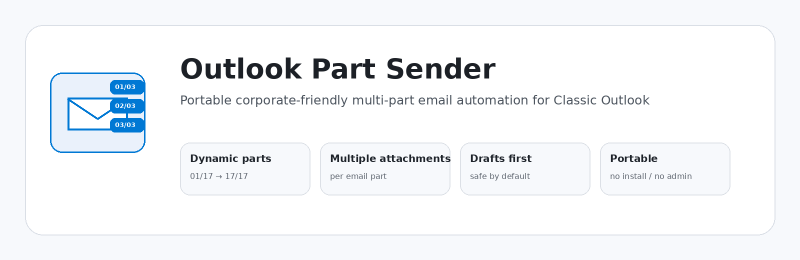
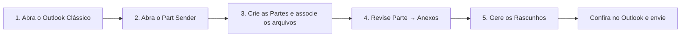
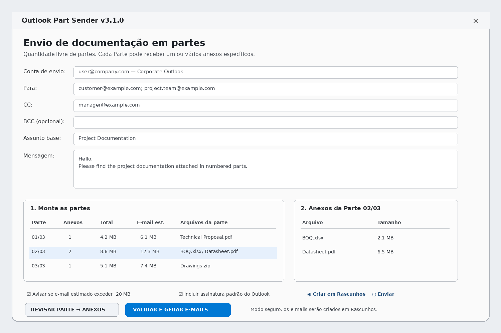
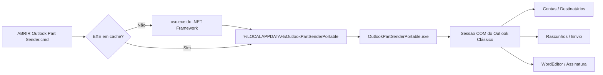

# Outlook Part Sender

> **Arquivos demais para um único e-mail? Divida a entrega em e-mails numerados no Outlook sem fazer tudo manualmente.**



[](../../releases/latest)
[](#por-que-a-versão-portátil)
[](#requisitos)
[](#requisitos)
[](src/OutlookPartSenderPortable.cs)
[](LICENSE)

**Versão recomendada: `v3.1.0 Portable Corporate`.**

**English:** [README.md](README.md)

---

## O que é esse programa?

O Outlook Part Sender é um pequeno programa portátil para Windows criado para resolver um problema muito comum:

> **Você precisa enviar muitos arquivos ou arquivos grandes, mas o destinatário não consegue receber tudo em um único e-mail.**

Em vez de criar manualmente vários e-mails quase iguais e escrever:

```text
Parte 01/17
Parte 02/17
Parte 03/17
...
Parte 17/17
```

o programa monta essa sequência para você.

Você informa **uma única vez** os destinatários, assunto e mensagem, cria quantas Partes precisar, escolhe quais anexos pertencem a cada Parte, revisa tudo e deixa o programa criar os e-mails no Outlook.

Por padrão ele cria **Rascunhos**, para você conferir antes de qualquer envio.

---

## Qual problema ele resolve?

Imagine que você precisa entregar:

```text
Proposta Técnica.pdf
BOQ.xlsx
Desenhos Elétricos.zip
Datasheets.zip
Relatórios de Teste.zip
Fotos.zip
Documentação Final.zip
```

O pacote completo ultrapassa o limite de tamanho aceito pelo e-mail do cliente.

### Sem o Outlook Part Sender

Você teria que:

1. criar um novo e-mail;
2. copiar os destinatários;
3. copiar o CC;
4. copiar o assunto;
5. escrever `Parte 01/07`;
6. colar a mesma mensagem;
7. anexar os arquivos corretos;
8. repetir tudo para `02/07`, `03/07`, `04/07`...
9. conferir manualmente se nenhum arquivo foi esquecido ou colocado na Parte errada.

Funciona, mas quanto maior o número de Partes, maior a chance de erro.

### Com o Outlook Part Sender

Você monta a entrega uma única vez:

```text
Documentação do Projeto

Parte 01/04
  ├─ Proposta Técnica.pdf
  └─ BOQ.xlsx

Parte 02/04
  └─ Datasheets.zip

Parte 03/04
  ├─ Desenho 01.pdf
  ├─ Desenho 02.pdf
  └─ Desenho 03.pdf

Parte 04/04
  └─ Documentação Final.zip
```

E o programa cria:

```text
Documentação do Projeto - Parte 01/04
Documentação do Projeto - Parte 02/04
Documentação do Projeto - Parte 03/04
Documentação do Projeto - Parte 04/04
```

cada um com os anexos que você definiu.

---

## Em 1 minuto: como usar?



### 1 — Preencha os dados do e-mail

Você informa apenas uma vez:

- conta do Outlook que será usada;
- **Para**;
- **CC**;
- **BCC** se necessário;
- assunto base;
- mensagem.

### 2 — Crie as Partes

Existem dois jeitos.

**Modo rápido — um arquivo por Parte**

Clique em **Arquivos → Partes** e escolha vários arquivos.

```text
Arquivo A.pdf -> Parte 01/03
Arquivo B.pdf -> Parte 02/03
Arquivo C.zip -> Parte 03/03
```

**Modo personalizado — vários arquivos na mesma Parte**

Crie uma nova Parte e escolha exatamente quais arquivos pertencem a ela.

```text
Parte 01/03
  ├─ Proposta.pdf
  └─ BOQ.xlsx
```

### 3 — Revise

Use **Revisar Parte → Anexos**.

Essa é a conferência mais importante: antes de criar os e-mails, você consegue ver exatamente quais arquivos irão em cada Parte.

### 4 — Gere como Rascunhos

A opção padrão e mais segura é **Criar em Rascunhos**.

O programa cria todos os e-mails na pasta Rascunhos do Outlook. Você pode abrir, conferir rapidamente e enviar normalmente.

### 5 — Envio automático é opcional

Se você selecionar **Enviar**, o programa pede uma confirmação adicional antes de entregar as mensagens ao Outlook.

---

## Antes x depois

| Fazendo manualmente | Com Outlook Part Sender |
|---|---|
| Criar cada e-mail | Montar o lote uma vez |
| Repetir Para / CC | Para / CC / BCC compartilhados |
| Digitar `01/17`, `02/17` | Numeração automática |
| Lembrar qual arquivo vai em qual e-mail | Anexos definidos por Parte |
| Fácil esquecer ou duplicar arquivo | Revisão Parte → Anexos |
| Trabalhoso com 10+ e-mails | Mesmo processo para 2, 17, 100+ Partes |
| Risco de clicar em Enviar cedo demais | Rascunhos são o padrão |

---

## Para quem ele pode ser útil?

Por exemplo:

- engenharia e construção;
- gerenciamento de projetos;
- compras e comercial;
- propostas técnicas e concorrências;
- documentação e controle documental;
- jurídico;
- operações;
- consultorias;
- fornecedores enviando desenhos, relatórios ou datasheets;
- qualquer pessoa que lide com limite de tamanho no e-mail do destinatário.

Ele **não é uma ferramenta de marketing ou disparo em massa**. O objetivo é organizar entregas documentais para destinatários conhecidos.

---

## Prévia da interface



> Imagem demonstrativa baseada na interface da v3.1.0. Nenhum dado real de empresa ou cliente é mostrado.

---

## Por que a versão portátil?

O projeto passou por algumas arquiteturas diferentes. A versão atual foi mantida propositalmente simples porque computadores corporativos frequentemente restringem extensões do Outlook.

A `v3.1.0 Portable Corporate`:

- **não instala** add-in no Outlook;
- **não altera** VBA nem `VbaProject.OTM`;
- **não registra** add-in COM no Outlook;
- **não exige** Visual Studio ou VSTO;
- **não pede** administrador;
- **não armazena** senha do Outlook;
- usa o perfil já configurado do **Outlook Clássico**.

O launcher prepara o executável local a partir do código C# incluído no pacote, usando o compilador do .NET Framework disponível no Windows.

---

## Principais recursos

- quantidade dinâmica de Partes;
- um ou vários anexos por Parte;
- **Arquivos → Partes** para o caso simples;
- **Nova Parte** para agrupamentos personalizados;
- Para / CC / BCC comuns ao lote;
- escolha da conta do Outlook;
- numeração automática `Parte NN/NN`;
- assinatura padrão do Outlook via WordEditor;
- reordenação das Partes;
- revisão **Parte → Anexos** antes da geração;
- validação dos destinatários pelo Outlook;
- estimativa de tamanho por e-mail;
- salvar/carregar montagem `.opsparts.json`;
- **Rascunhos como padrão**;
- Enviar exige confirmação adicional;
- configuração do lote congelada enquanto os e-mails são criados;
- proteção de erro parcial com ID do lote.

A numeração cresce automaticamente:

```text
2 Partes      -> 01/02 ... 02/02
17 Partes     -> 01/17 ... 17/17
100 Partes    -> 001/100 ... 100/100
1000 Partes   -> 0001/1000 ... 1000/1000
```

---

## Download

Entre na [última Release](../../releases/latest) e baixe:

```text
Outlook_Part_Sender_v3.1.0_PORTABLE_CORPORATE.zip
```

Depois **extraia o ZIP completo**. Não execute o launcher diretamente dentro do arquivo compactado.

---

## Requisitos

- Windows 10 ou Windows 11;
- **Outlook Clássico para Windows** já configurado e logado;
- .NET Framework 4.x disponível no Windows;
- política do computador permitindo `.cmd`, `csc.exe`, executáveis em `%LOCALAPPDATA%` e automação COM do Outlook.

> O **Novo Outlook** não é suportado nesta arquitetura.

---

## Como abrir

1. Extraia o ZIP.
2. Abra o **Outlook Clássico**.
3. Dê duplo clique em:

```text
ABRIR Outlook Part Sender.cmd
```

Na primeira execução, o programa é preparado localmente em:

```text
%LOCALAPPDATA%\OutlookPartSenderPortable
```

Nas próximas execuções o mesmo executável é reutilizado enquanto a versão permanecer igual.

> **Executando a partir de um clone do GitHub:** `launcher/ABRIR Outlook Part Sender.cmd` também procura o fonte em `../src/OutlookPartSenderPortable.cs`.

---

## Primeiro teste recomendado

Antes de usar em uma entrega importante:

1. coloque **seu próprio e-mail** em Para;
2. crie 3 Partes;
3. coloque 1 arquivo na Parte 01;
4. coloque 2 arquivos na Parte 02;
5. coloque 1 arquivo na Parte 03;
6. mantenha **Criar em Rascunhos**;
7. gere o lote.

Confira:

- exatamente 3 Rascunhos;
- assuntos `01/03`, `02/03`, `03/03`;
- anexos corretos;
- Para / CC / BCC corretos;
- mensagem correta;
- assinatura do Outlook correta.

Depois disso você pode continuar usando Rascunhos nos envios oficiais — **recomendado** — ou escolher conscientemente **Enviar**.

---

## Rascunhos x Enviar

### Rascunhos — recomendado

O programa cria os e-mails na pasta **Rascunhos**.

Nada é intencionalmente enviado pelo Outlook Part Sender. Você mantém uma última conferência humana antes da entrega.

### Enviar — opcional

O modo Enviar só é utilizado se você selecionar essa opção e confirmar novamente.

Isso entrega as mensagens ao Outlook para processamento, mas não garante recebimento final. Regras do Exchange, DLP, antispam e limites de tamanho do destinatário continuam valendo.

---

## O que o programa NÃO faz

O Outlook Part Sender não:

- aumenta o limite de tamanho do e-mail;
- compacta arquivos automaticamente;
- envia documentos para nuvem;
- contorna políticas da empresa;
- armazena sua senha do Outlook;
- lê sua caixa de e-mail para marketing ou análise;
- envia nada enquanto estiver em Rascunhos.

Ele apenas organiza e gera a sequência de e-mails numerados.

---

## Como funciona tecnicamente



O programa usa automação COM do Outlook via `dynamic`, sem distribuir Office PIAs. O código-fonte completo está incluído no repositório e na Release.

---

## Trechos técnicos importantes

O código-fonte completo está em [`src/OutlookPartSenderPortable.cs`](src/OutlookPartSenderPortable.cs).

### Conexão com Outlook

```csharp
Type outlookType = Type.GetTypeFromProgID("Outlook.Application");

try
{
    outlook = Marshal.GetActiveObject("Outlook.Application");
}
catch
{
    outlook = Activator.CreateInstance(outlookType);
}
```

### Numeração dinâmica

```csharp
int width = Math.Max(2, total.ToString().Length);
```

### Conta de envio

```csharp
((dynamic)mail).SendUsingAccount = account.ComObject;
```

### Validação dos destinatários

```csharp
bool ok = (bool)recipients.ResolveAll();
```

### Assinatura do Outlook

```csharp
doc = ((dynamic)inspector).WordEditor;
```

### Rascunho ou envio

```csharp
if (snapshot.SendNow)
{
    mail.Send();
}
else
{
    mail.Save();
}
```

Antes da geração, o programa cria um snapshot da configuração atual e bloqueia a interface. Assim, destinatários, modo de envio e associação de anexos não podem ser alterados no meio do lote.

---

## Montagens salvas

Uma montagem pode ser salva como:

```text
*.opsparts.json
```

Ela pode conter:

- identificador da conta selecionada;
- Para / CC / BCC;
- assunto;
- mensagem;
- caminhos locais dos anexos;
- configuração do alerta de tamanho.

Ela **não contém sua senha do Outlook**.

Como pode conter destinatários, texto e caminhos de arquivos, trate esse JSON conforme a política de segurança da sua organização.

Ao carregar uma montagem, o programa volta automaticamente para **Rascunhos**.

---

## Ambiente corporativo

A versão portátil evita:

- instalação;
- add-in do Outlook;
- VSTO;
- Visual Studio;
- injeção VBA;
- alteração de `VbaProject.OTM`;
- registro do Outlook;
- elevação de administrador;
- PowerShell no launcher.

Mesmo assim, a política da empresa pode bloquear `.cmd`, `csc.exe`, executáveis em `%LOCALAPPDATA%` ou automação COM.

O projeto não tenta contornar controles corporativos. Se uma política bloquear a ferramenta, a autorização deve ser tratada com a equipe de TI/segurança.

---

## Cache local

Depois da primeira execução:

```text
%LOCALAPPDATA%\OutlookPartSenderPortable
```

Para apagar somente o cache local:

```text
LIMPAR CACHE LOCAL.cmd
```

Isso não remove nem altera nada no Outlook.

---

## Estrutura do repositório

```text
.
├─ README.md
├─ README.pt-BR.md
├─ CHANGELOG.md
├─ LICENSE
├─ SECURITY.md
├─ CONTRIBUTING.md
├─ VERSION
├─ src/
│  └─ OutlookPartSenderPortable.cs
├─ launcher/
│  ├─ ABRIR Outlook Part Sender.cmd
│  └─ LIMPAR CACHE LOCAL.cmd
├─ docs/
│  ├─ architecture.md
│  ├─ user-guide.md
│  ├─ user-guide.pt-BR.md
│  ├─ technical-notes.md
│  ├─ security-and-privacy.md
│  ├─ troubleshooting.md
│  └─ images/
└─ release-notes/
   └─ v*.md
```

---

## Histórico

| Versão | Arquitetura | Status | Principal evolução |
|---|---|---|---|
| **v3.1.0** | C# portátil + compilação local | **Atual / Recomendada** | Sem instalação, registro ou add-in |
| v3.0.0 | COM Add-in | Experimento legado | Abordagem add-in por usuário |
| v2.0.2 | VSTO Add-in | Experimento arquivado | Final da linha VSTO |
| v2.0.1 | VSTO Add-in | Substituída | Hardening de segurança/build |
| v2.0.0 | VSTO Add-in | Substituída | Primeira migração Ribbon/VSTO |
| v1.4.0 | PowerShell + Outlook COM | Legado | Arquitetura PowerShell final |
| v1.3.0 | PowerShell + Outlook COM | Legado | Partes dinâmicas + vários anexos |
| v1.2.0 | PowerShell + Outlook COM | Legado | Conta/BCC/tamanho/validações |
| v1.0.1 | PowerShell + Outlook COM | Substituída | Compatibilidade PowerShell 5.1 |
| v1.0.0 | PowerShell + Outlook COM | Protótipo | Primeiro conceito funcional |

Veja [`CHANGELOG.md`](CHANGELOG.md) e [`release-notes/`](release-notes/).

---

## Validação

A v3.1.0 inclui validações estáticas para entrada portátil, conexão com Outlook Clássico, numeração dinâmica, vários anexos, caminhos de Rascunho/Enviar, resolução de destinatários, conta selecionada, assinatura, snapshot do lote, bloqueio da interface e ausência de limite fixo de Partes.

A arquitetura portátil atual também foi confirmada funcionando em um PC corporativo Windows real com Outlook Clássico corporativo.

---

## Problemas e diagnóstico

Consulte [`docs/troubleshooting.md`](docs/troubleshooting.md).

Se houver falha na primeira preparação, o arquivo mais útil é:

```text
%LOCALAPPDATA%\OutlookPartSenderPortable\compile.log
```

---

## Segurança e privacidade

Leia [`SECURITY.md`](SECURITY.md) e [`docs/security-and-privacy.md`](docs/security-and-privacy.md).

O projeto não deve ser usado para contornar políticas da empresa ou proteções do Outlook.

---

## Contribuindo

Issues e Pull Requests são bem-vindos. Consulte [`CONTRIBUTING.md`](CONTRIBUTING.md).

---

## Licença

MIT License. Consulte [`LICENSE`](LICENSE).

---

## Aviso

Este é um utilitário independente para Microsoft Outlook Clássico. Não é afiliado, endossado ou distribuído pela Microsoft.
