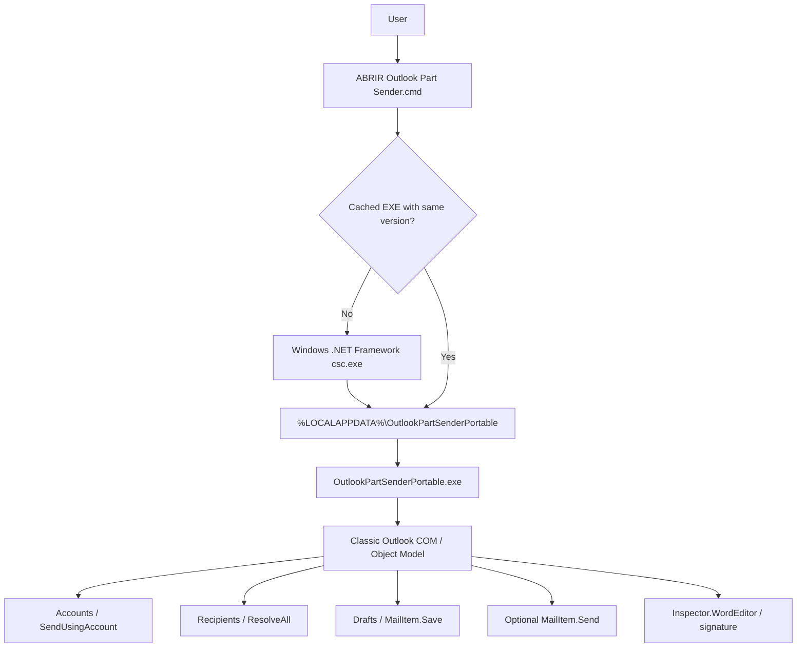

# Architecture

## Current architecture — v3.1.0

The current recommended release is a portable C# WinForms application launched from a small `.cmd` file.



## Why portable?

The project explored three architectures:

1. PowerShell + Outlook COM.
2. VSTO application-level add-in.
3. Per-user COM add-in.
4. Portable C# utility.

The portable architecture became the recommended option because it minimizes changes to managed corporate endpoints:

- no Outlook registration;
- no Ribbon/add-in installation;
- no VBA;
- no Visual Studio/VSTO requirement;
- no admin elevation;
- transparent source compiled locally.

## Core data model

`PartModel` represents one email part.

Each Part has its own attachment collection. This is intentionally different from the early `one file = one email` model.

Before execution, the UI state is copied into `BatchSnapshot`, so changing UI controls cannot alter a batch already in progress.

## Outlook integration

The portable app connects to Classic Outlook via the COM ProgID:

```csharp
Outlook.Application
```

Late binding through `dynamic` is used so the distributed source does not depend on a packaged Office PIA.

## Message generation

For each Part:

1. Create a new Outlook mail item in the selected account's Drafts store when possible.
2. Apply `SendUsingAccount`.
3. Populate To / CC / BCC / subject.
4. Load the Outlook signature if enabled.
5. Insert the common body before the signature through WordEditor.
6. Add the Part's attachments.
7. Resolve recipients.
8. Save to Drafts or explicitly Send.
9. Release COM references.

If an uncommitted message fails, it is discarded.
